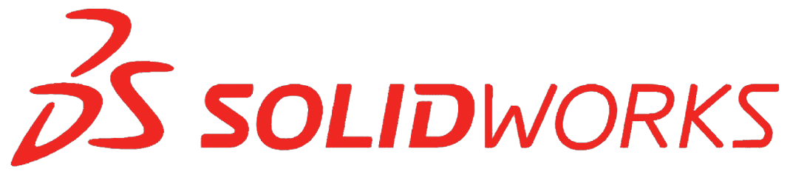
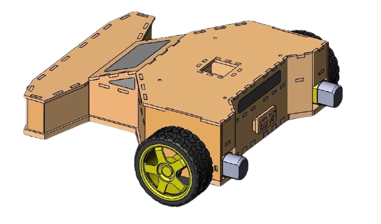
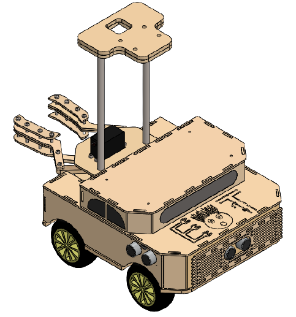
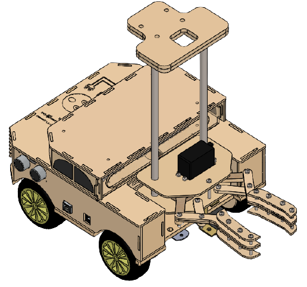
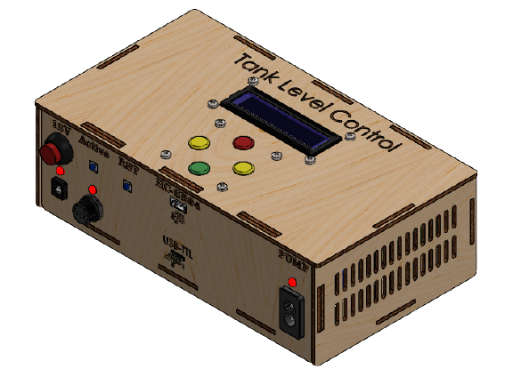
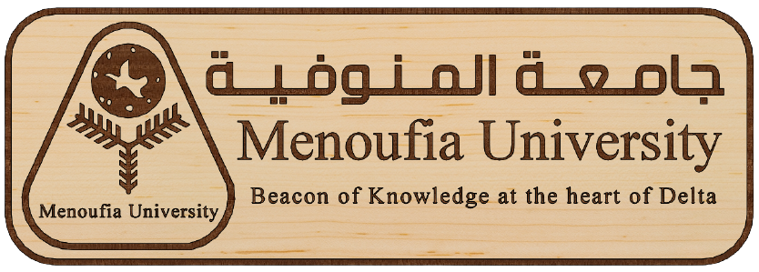
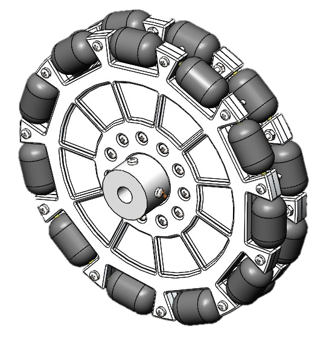
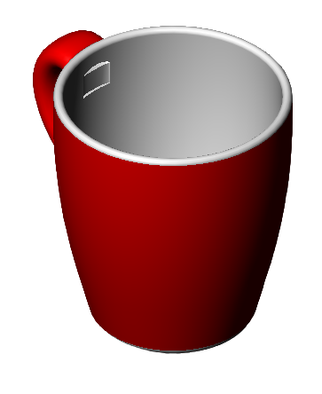

  

<h1 align="center">SolidWorks Projects</h1>

     

---
## Introduction
Hello, thanks for being here.
This is a hobbyist repo for some of my projects done using SolidWorks CAD SW. It was a hobby for me to design shapes for hobbyist Projects. In the coming sections, there are some examples of my projects. Enjoy.

---
## What this repo contains?
This repo contains some of my projects using SolidWorks. These projects consists of both Laser Cutting projects and 3d Models projects.

Laser Cutting projects contain DXF files as well as parts and pics.

## Some Example Projects
#### Line Follower Robot

  

#### Line Follower, Transporter, and Maze

  

  

w#### Tank evel Control Enclosure

  

#### Logo for Menoufia University
This was a project for ROBOCON Menoufia team

  

 

#### OMNI Wheel

  

#### Mug

  

## Where to find me

 

- 💼 any freelance work? do reach, [email](ma.karam272@gmail.com)
- 💬 ask me about anything, i am happy to help

## Support me
If you like what I do, maybe consider buying me a coffee/tea 🥺👉👈

[Or leave a tip! ヾ(°∇°*)](https://www.paypal.me/kmahmoud633)

---
## Licenses
 All DOCUMENTS inside this work is licensed under a <a rel="license" href="http://creativecommons.org/licenses/by-sa/4.0/">Creative Commons Attribution-ShareAlike 4.0 International License</a>.

All SOURCE codes & BINARIES are licensed under Apache.

  

  

---
## Credits
All credits and sources are listed inside the page and references themselves.
